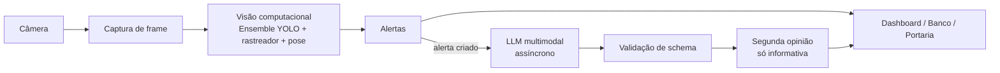

# Sprint 3: relatório técnico (LLM multimodal)

Versão curta para entrega. O diário completo, com todas as medições, está em
[SPRINT3.md](SPRINT3.md); as respostas reais estão em
[SPRINT3-EXEMPLOS.md](SPRINT3-EXEMPLOS.md); o diagrama está em
[arquitetura-sprint3.svg](arquitetura-sprint3.svg).

## 1. Tarefa multimodal

Dar uma **segunda opinião** sobre cada situação que o detector de EPIs (Sprint 2)
transforma em alerta: o LLM recebe o quadro, diz quais EPIs realmente estão
ausentes, o nível de risco, o quanto confia na própria leitura e o que o
supervisor deve fazer. Ele **complementa** o detector; não o substitui e não
decide nada sozinho.

## 2. Modelo escolhido e por quê

**`gemini-3.6-flash`** (Google, por API), com a versão fixada no `.env`
(`GEMINI_MODEL`), sem alias tipo "latest", para que os testes gravados
continuem significando a mesma coisa daqui a um mês.

Motivos técnicos:

- **Recebe imagem e texto nativamente** e aceita instrução de formato JSON, que é
  o que o fluxo exige.
- **Não consome a GPU local.** A placa já está ocupada com o ensemble YOLO e a
  pose; um modelo de visão e linguagem local disputaria a mesma memória e
  deixaria o vídeo mais lento.
- **Nível gratuito** com o custo de integração mais baixo, adequado a um
  protótipo.
- **Bom desempenho em português**, língua do prompt e das respostas.
- Uma versão anterior do projeto usava o `gemini-2.0-flash`, que foi aposentado
  pela API (erro 404); a troca foi forçada, mas a escolha se sustenta pelos itens
  acima.

Alternativas consideradas e **não testadas** neste projeto: APIs pagas de outros
fornecedores (mesma classe de capacidade, sem nível gratuito) e modelos abertos de
visão e linguagem rodando localmente (mantêm as imagens dentro da empresa, o que é
uma vantagem real, mas exigem GPU que já está em uso). Não há comparação medida
entre elas.

## 3. Integração

Fluxo: `alerta criado → frame JPEG (o mesmo que o loop já codificou) → LLM → JSON
validado → segunda opinião na tela`.

- `app/llm/` recebe bytes de imagem e devolve uma `AnaliseRisco` **validada**, ou
  `None`. Não conhece Flask, banco nem socket.
- `app/services/llm_risk_service.py` decide **quando** chamar (só em alerta
  **criado**, no máximo uma chamada em voo por câmera, debounce por janela de
  tempo, **descarte em vez de fila**) e roda fora da thread do vídeo.
- A resposta vai para um campo próprio (`segunda_opiniao`) e para o evento
  `llm_segunda_opiniao`. Na interface: **aba "Mais ▾ → Segunda opinião"**.
- **Regra central:** o LLM **não cria, não resolve e não suprime alerta**. Um teste
  entrega uma análise que discorda de tudo e exige que os alertas fiquem
  idênticos.
- Sem `GEMINI_API_KEY` a camada nasce **desligada** e o sistema funciona normal.
  Ligada, o custo em FPS ficou dentro do ruído em 3 de 4 execuções (entre -2% e +2%);
  a primeira execução deu -37% e não se repetiu, causa **não verificada**.

## 4. Prompts (duas versões)

Os dois estão em `app/llm/prompts/` (`v1.md`, `v2.md`), com o mesmo schema.

- **v1:** pede a análise e o formato.
- **v2:** mesmo schema, critério de decisão diferente. Manda **contar as pessoas
  antes**, distinguir **"ausente" de "não visível"** (pessoa de costas, cortada ou
  distante), **calibrar a confiança** por essa checagem (abaixo de 0,5 quando há
  oclusão) e ponderar a exigência **pela atividade** (colete pesa mais em via de
  máquinas).

Efeito medido (EPIs apontados como ausentes, v1 → v2):

| cena | v1 → v2 | confiança |
|---|---|---|
| segura | 3 → **0** | 0,90 → 0,80 |
| risco | 4 → **2** | 0,95 → 0,85 |
| ambígua | 2 → 2 | 0,95 → 0,85 |

A v1 trocou dois falsos positivos de capacete por três de luva, óculos e máscara,
afirmados com 0,90 de confiança numa cena em que a própria v2 diz que essas peças
não dá para verificar à distância. Foi o argumento a favor da v2. Antes de medir
registramos que a v2 reportaria menos ausências na cena ambígua; **errado**: ficou
igual. Está publicado assim.

## 5. Estrutura da resposta

```json
{
  "nivel_risco": "baixo | medio | alto | critico",
  "epis_ausentes": ["helmet", "vest", "gloves", "glasses", "mask", "safety_shoe"],
  "justificativa": "o que foi observado, incluindo o que NÃO deu para observar",
  "confianca": 0.0,
  "acao_recomendada": "providência concreta para o supervisor"
}
```

Validada por schema (pydantic): campo extra é recusado, `epis_ausentes` só aceita os
mesmos 6 EPIs do detector (para comparar lado a lado) e a **omissão do campo não
vira "tudo certo"**. Resposta inválida é descartada e registrada, nunca vira
alerta. É uma adaptação do exemplo do enunciado: **não** há campos `situacao` nem
`tipo_risco` separados; essa descrição fica dentro da `justificativa`.

## 6. Testes

Três imagens reais, duas versões de prompt cada, seis chamadas gravadas:

- **Segura:** dois trabalhadores de capacete e colete.
- **Risco:** obra de ponte, cerca de 9 pessoas sem capacete nem colete.
- **Ambígua:** três de capacete, nenhum de colete, concretagem em área cercada.

Os testes `tests/test_llm_goldens.py` (18) revalidam as respostas gravadas **sem
rede**. Entradas e saídas completas: [SPRINT3-EXEMPLOS.md](SPRINT3-EXEMPLOS.md).

## 7. Resultados, com os três casos que o enunciado pede

- **Interpretou corretamente (cena segura):** o YOLO sozinho acusava
  `missing_helmet` crítico para dois trabalhadores de capacete branco. A v2 disse
  "ambos utilizando capacete e colete refletivo" e deixou `epis_ausentes` vazio. É
  o caso em que a segunda opinião se pagou.
- **Ambíguo (cena de concretagem):** o YOLO diz que faltam os coletes; o LLM não
  lista colete e aponta luvas e óculos por causa do concreto fresco. Quem tem razão
  depende da norma da atividade, não da imagem, e o sistema mostra as duas leituras
  em campos separados para o técnico de segurança decidir.
- **Interpretação fraca (v1 na cena segura):** afirmou luvas, óculos e máscara
  ausentes com 0,90 de confiança sem conseguir vê-los. É excesso de certeza, o erro
  que a v2 corrige.

## 8. Erros e limitações

- **Três imagens provam existência, não acurácia.** Acertar 3 de 3 acontece 12,5%
  das vezes por sorte. Precisão e revocação exigiriam dezenas de cenas anotadas.
- **Latência de 16 a 38 s** (mediana ~27 s) no nível gratuito, sujeita a erro 503 por
  alta demanda (9 tentativas falharam antes de fechar as 6 chamadas). Por isso a
  chamada é assíncrona e o teto de espera é de 30 s.
- **Privacidade:** o quadro sai do computador para o serviço de um terceiro. Numa
  planta real, com trabalhadores identificáveis, isso pede análise de proteção de
  dados (LGPD) e talvez um modelo local. Não foi avaliado neste projeto.
- **O LLM pode errar ou inventar.** Por isso nunca decide sozinho.
- A camada **não foi reexecutada com o detector atual** (ensemble Vyra + SH17).
  As 3 imagens e as 6 respostas são de antes; o falso positivo de capacete
  descrito na cena segura aconteceu com o detector de então.

## 9. Comparação com a Sprint 2 (detecção com YOLO)

| critério | YOLO (Sprint 2) | LLM multimodal (Sprint 3) |
|---|---|---|
| Detectar objetos | Forte: caixa, posição e contagem | Descreve, mas **não dá caixa nem coordenada** |
| Compreender contexto | Não: só sabe o que está no quadro, nunca o que falta é violação | **Sim:** pondera a atividade, oclusão e exposição |
| Treinamento | Precisa: treinamos um modelo (SH17) e ainda erra fora do dataset | **Nenhum**, só o prompt |
| Flexibilidade | Uma lista fixa de classes | Muda a pergunta trocando o prompt |
| Velocidade | Cerca de 8 a 10 quadros por segundo em GPU, contínuo | **16 a 38 s** por análise, sob demanda |
| Consistência | Mesma imagem, mesma resposta | v1 e v2 deram respostas diferentes para a mesma imagem; sem repetição medida |
| Erros | Falso positivo e falso negativo de EPI (medido na cena segura) | Excesso de certeza e afirmar o que não vê (v1) |
| Integração | Pesos, GPU, rastreador, regras por pessoa | **Uma chamada de API**, mas com fila, limite e validação |
| Custo | Zero por chamada, exige GPU local | Nível gratuito no protótipo; em escala, custo por imagem |

Não há vencedor: o YOLO é rápido, barato e preciso em "onde está", e o LLM entende
"o que significa". Usados juntos, um cobre a fraqueza do outro.

## 10. Arquitetura

Diagrama: [arquitetura-sprint3.svg](arquitetura-sprint3.svg).



## 11. Evidências de execução

Já existem: as 6 respostas reais (`tests/goldens/`), os exemplos
([SPRINT3-EXEMPLOS.md](SPRINT3-EXEMPLOS.md)), os testes e o benchmark de FPS
(`scripts/bench_llm_worker.py`).

Faltam, e dependem de rodar o sistema com a chave da API: **prints da aba "Segunda
opinião"** com uma análise ao vivo e um **vídeo curto** da demonstração.
