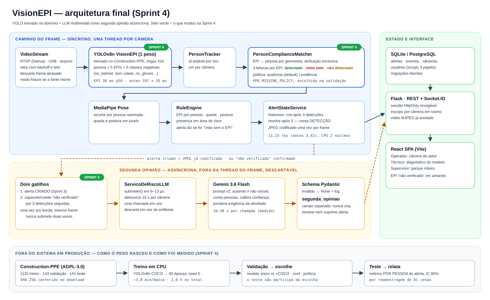
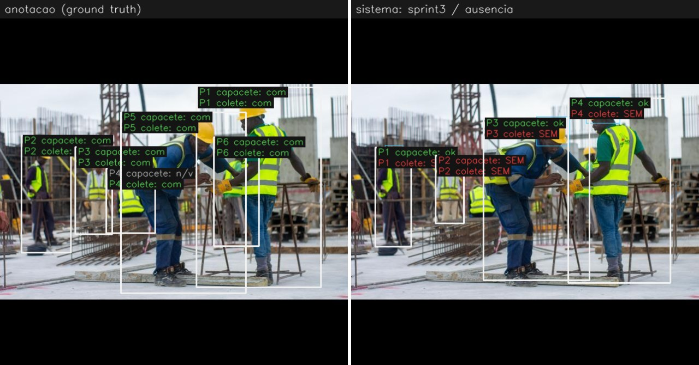
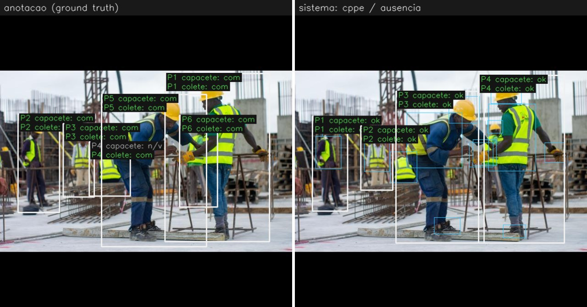

# Sprint 4 — solução final: YOLO treinado no domínio + LLM como segunda opinião

Máquina desta sprint: Intel Xeon 2,1 GHz, **2 núcleos, sem GPU**, Linux,
Python 3.11, `torch 2.5.1`, `ultralytics 8.3.40`. É mais fraca que o Ryzen 7
5700X das Sprints 2 e 3 — os números absolutos de FPS **não** se comparam com
os da [BENCH.md](BENCH.md); os de antes/depois desta página foram medidos na
mesma máquina, na mesma sessão.

Tabelas completas, geradas a partir dos JSONs e sem número digitado à mão:
[avaliacao/RESUMO.md](avaliacao/RESUMO.md). Diagrama:
[arquitetura_sprint4.png](arquitetura_sprint4.png) (fonte em `.svg`).

## TL;DR

| | Sprint 3 (produção até aqui) | Sprint 4 | como foi medido |
|---|---|---|---|
| modelo | Vyra YOLOv8m + YOLOv8n COCO (2 pesos) | **VisionEPI YOLOv8n (1 peso)**, treinado no domínio | — |
| alerta "sem capacete": precisão | 0,39 | **0,85** | teste, 236 pessoas, por pessoa |
| alerta "sem capacete": revocação | 0,87 | **0,92** | idem |
| alerta "sem colete": precisão | 0,34 | **0,87** | idem |
| alerta "sem colete": revocação | **0,79** | 0,69 | idem — **piorou** |
| alertas falsos de capacete em canteiro real, 1 imagem por cena | 27 de 92 pessoas de capacete | **3 de 92** | 54 cenas industriais distintas |
| inferência por imagem | 354 ms | **49 ms** | mesma CPU |
| FPS do pipeline completo (detecção a cada frame) | 3,42 | **11,15** | `bench_pipeline.py`, 240 frames |

**O avanço central** é que o sistema parou de acusar quem está de EPI. Na
Sprint 3, 61% dos alertas de capacete eram sobre pessoas de capacete
(52 de 85). Agora são 15% (6 de 41).

**O que não melhorou, e está dito:** a revocação do colete caiu de 0,79 para
0,69. Das 18 violações de colete perdidas, 11 são pessoas que o detector nem
encontrou; das 7 restantes, a revisão visual mostrou que 5 são **erros da
anotação** (a pessoa está de colete e o dataset diz que não) — ver
[auditoria](#o-quanto-dos-erros-é-da-anotação). A revisão cobriu só parte dos
erros, então o número oficial continua 0,69.

---

## 1. O problema

Segurança do trabalho reativa: inspeção periódica, checklist, investigação
depois do acidente. O VisionEPI monitora continuamente câmeras comuns (RTSP,
USB) e alerta em tempo real sobre **pessoa sem EPI** (capacete, colete, luvas,
óculos, calçado), **queda / postura de risco** e **presença em área de
risco**, com evidência fotográfica e um indicador de tendência. Base normativa:
NR-6 (EPI) e NR-18 (construção).

O erro que mais importa não é o mesmo nos dois sentidos:

- **alerta falso** (acusar quem está de EPI) gasta a atenção do supervisor e,
  repetido, faz a equipe ignorar todos os alertas;
- **violação sem alerta** é o acidente que o sistema existe para evitar.

A Sprint 3 encontrou, em 3 cenas, o primeiro tipo acontecendo: dois
trabalhadores de capacete branco acusados de "sem capacete" com severidade
crítica. E registrou que 3 cenas não sustentavam afirmação de acurácia
nenhuma. **A Sprint 4 começa aí: medir em escala e corrigir a causa.**

## 2. Como a solução evoluiu

| sprint | o que entrou | o que a medição mostrou |
|---|---|---|
| 1 (jul) | protótipo VisionEPI | — |
| 2 (ago) | YOLOv8 **Vyra** (14 classes) + YOLOv8n COCO para pessoa, MediaPipe Pose por pessoa, tracker IoU, matching EPI↔pessoa, multi-câmera, React + Socket.IO, autenticação com 3 papéis | — |
| 3 (set) | **LLM multimodal** (Gemini 3.6 Flash) como segunda opinião assíncrona; prompts v1/v2; resiliência RTSP; bench | classe `Person` do Vyra não generaliza (0 detecções em 36 células) → segundo modelo obrigatório, −20% FPS; Vyra dá 0,14–0,26 de confiança para capacete visível (Fase 9); falso "sem capacete" na cena segura; o LLM v2 **corrige** esse falso positivo; 16–38 s por chamada |
| **4 (set)** | **peso próprio** treinado no domínio; **classes negativas** e o estado "não verificado"; **segundo gatilho** do LLM; **avaliação por pessoa** em conjunto anotado | tabela acima |

A decisão da Sprint 4 sai direto dos achados da Sprint 3: se o capacete é
fraco **no modelo** (e não na resolução — Fase 9 da BENCH.md), trocar limiar
não resolve e o LLM só remedia um alerta por vez, 30 s depois. A causa tem de
ser atacada no detector.

## 3. Arquitetura final



Três planos:

1. **Caminho do frame (síncrono, uma thread por câmera).**
   `VideoStream` → **YOLOv8n VisionEPI** (um peso: pessoa + 5 EPIs + 5 classes
   negativas) → `PersonTracker` → `PersonComplianceMatcher` (EPI → pessoa por
   geometria, com 3 leituras por EPI) → MediaPipe Pose por pessoa →
   `RuleEngine` → `AlertStateService` (histerese) → JPEG codificado uma vez.
2. **Segunda opinião (assíncrona, descartável).** Dois gatilhos — alerta
   criado, ou capacete/colete "não verificado" por 3 detecções — levam o JPEG
   já codificado ao `ServicoDeRiscoLLM` (`submeter()` em 9–13 µs, debounce
   15 s, uma chamada em voo, descarte em vez de fila). Gemini 3.6 Flash com
   prompt v2; resposta validada por schema; vai para `segunda_opiniao`.
   **Invariante mantida da Sprint 3: o LLM não cria, não resolve e não
   suprime alerta.**
3. **Estado e interface.** SQLite/PostgreSQL, Flask REST + Socket.IO com
   escopo por câmera, React SPA com os papéis Operador / Técnico / Supervisor.

### Por que YOLO **e** LLM, e não um só

| | YOLO treinado | LLM multimodal |
|---|---|---|
| latência | **38 ms** por frame (p50) | **16 a 38 s** por chamada (medido na Sprint 3) |
| custo | CPU local | cota de API, rede |
| cobre | todo frame, toda pessoa, sempre | 1 imagem a cada ≥15 s por câmera |
| sabe contexto? | não: "sem capacete" é sem capacete, no escritório ou na obra | sim: o prompt v2 pondera se o EPI é exigido naquela atividade |
| distingue ausente de não visível? | só com classe negativa detectada | sim, e foi o que corrigiu o falso positivo da Sprint 3 |

Um LLM sozinho não serve para monitoramento contínuo: 27 s de latência
mediana e uma chamada a cada 15 s. Um YOLO sozinho não sabe contexto nem
explica. A combinação usa cada um no que é bom — e o LLM **fora** do caminho
do frame, porque uma chamada dele congelaria o vídeo por meio minuto.

### Por que **um** peso, e não Vyra + COCO

Decidido **na validação** (143 imagens), nunca no teste:

| configuração (política ausência, conf 0,35) | revocação de pessoa | F1 capacete | F1 colete | ms/imagem |
|---|---|---|---|---|
| Sprint 3: Vyra m + COCO n | 0,84 | 0,60 | 0,58 | 358 |
| Sprint 4 + COCO para pessoa | 0,84 | 0,83 | 0,79 | 98 |
| **Sprint 4, um peso só** | **0,90** | **0,88** | **0,79** | **47** |

A classe `Person` do peso novo foi treinada com o resto do dataset e acha
mais pessoas que o COCO **neste domínio**. Somar o COCO não ajuda e dobra o
custo. `MULTI_PERSON_DETECTION=false` volta a ser o default — o oposto da
Sprint 3, e pela mesma razão: medição.

## 4. O modelo

| | |
|---|---|
| base | `yolov8n.pt` (COCO) |
| dataset | [Construction-PPE](https://docs.ultralytics.com/datasets/detect/construction-ppe/), Ultralytics, **AGPL-3.0**; SHA-256 `bef8dcb5…2c632ccc` conferido por `scripts/baixar_dataset.py` |
| divisão | 1132 treino · 143 validação · 141 teste |
| classes | helmet, gloves, vest, boots, goggles, **none** (= torso sem colete, verificado desenhando o ground truth), Person, **no_helmet, no_goggle, no_gloves, no_boots** |
| treino | 40 épocas, `imgsz=416`, batch 16, seed 0, `deterministic=True`, CPU — 2,6 h (`scripts/treinar_modelo.py`) |
| escolha do checkpoint | `best.pt` pela validação (ultralytics) |
| peso | `models/visionepi_cppe_n416.pt`, 6,2 MB, **versionado**; SHA-256 `f0dfeea7…caeae935` travado em `tests/test_onboarding.py` |

`imgsz=416` no treino porque é a resolução em que o pipeline roda. O Vyra foi
treinado a 640 e inferido a 416 — um dos descasamentos que a Sprint 3 mediu.

mAP50 no **teste** (ultralytics, `split=test`): all 0,53 · **helmet 0,92** ·
**vest 0,88** · Person 0,84 · goggles 0,79 · gloves 0,76 · boots 0,71 ·
none 0,46 · **no_helmet 0,14** · no_gloves 0,17 · no_goggle 0,16 · no_boots
0,03. As classes positivas são fortes; as **negativas são as mais fracas** —
e isso decide a política abaixo.

## 5. Ausente não é não visto: as classes negativas e a política

Até a Sprint 3, "missing" = "o detector não achou a caixa positiva". Isso
junta dois casos opostos: a pessoa **está sem** capacete, ou o capacete **não
foi visto** (pequeno, de costas, oculto). O prompt v2 da Sprint 3 já separava
os dois do lado do LLM; agora o detector também separa, porque os dois pesos
avaliados têm classes negativas (Vyra: `NO-Hardhat`...; peso novo:
`no_helmet`, `none`...).

O `PersonComplianceMatcher` associa as caixas negativas às pessoas pela mesma
geometria das positivas, num pool separado, e cada EPI sai com
`evidence ∈ {detectado, negativa_detectada, nao_detectado}`. A política
(`PPE_MISSING_POLICY`) decide o que vira alerta:

- **`ausencia`** (default): nada detectado = alerta. Alerta de quem foi *visto
  sem* o EPI sai com o sufixo "(visto sem o EPI)" e `metadata.evidence`.
- **`evidencia`**: só alerta quem foi visto sem o EPI; o resto fica
  **"não verificado"** (amarelo no painel, sem alerta) e aciona o LLM se
  persistir.

Escolhida na **validação**, F1 médio capacete + colete a conf 0,35:
**ausência 0,83 × evidência 0,62**. A evidência acerta 100% dos alertas de
capacete que dispara, mas só dispara 27% dos devidos — porque `no_helmet` é
a classe mais fraca do peso. O código das duas fica; o default é o medido.

## 6. Como foi testado

### Métrica por pessoa, não mAP

O operador não recebe "caixa de capacete com IoU 0,62"; recebe "Pessoa 3 sem
capacete". Então a avaliação (`app/vision/avaliacao.py`,
`scripts/avaliar_dataset.py`) roda **o pipeline do app** — `YoloPPEDetector`
+ `PersonComplianceMatcher`, na composição de `CameraWorker._analyze_frame` —
e mede o **alerta**:

1. o ground truth de cada pessoa anotada vira `presente` / `ausente` /
   `nao_visivel` por EPI (negativa anotada vence positiva: uma luva e uma mão
   nua é violação);
2. pessoa prevista ↔ anotada por IoU ≥ 0,5, casamento exclusivo;
3. **positivo = pessoa sem o EPI.** `nao_visivel` não entra na conta (não há
   verdade), mas os alertas disparados nesses casos são contados à parte;
4. **ponta a ponta:** pessoa anotada que o detector não achou conta como
   violação perdida;
5. as duas políticas são calculadas sobre **as mesmas detecções** (o modelo
   roda uma vez, o matcher duas): a diferença entre elas é só a regra.

10 testes unitários travam essa régua (`tests/test_avaliacao.py`).

### O conjunto de teste, olhado de perto

141 imagens, 236 pessoas. Duas coisas que um número agregado esconderia, e
que foram encontradas olhando a folha de contato inteira
([subconjuntos_test.json](avaliacao/subconjuntos_test.json)):

- **47 das 141 imagens são quadros da mesma pessoa no mesmo terraço.** Ao
  todo, 67 imagens estão em 7 sequências; são **81 cenas distintas**. Por
  isso o IC 95% reamostra **cenas**, não imagens — 47 quadros de uma cena não
  são 47 evidências independentes.
- **Todas as 38 violações de capacete do teste estão em cenas não
  industriais** (escritório, rua, esporte, retrato). Nas 54 cenas industriais
  distintas há **zero** pessoas sem capacete e 5 sem colete. Ou seja: a
  revocação vem de pessoas fora de obra, e o que o teste mede **em canteiro**
  é sobretudo o alerta falso.

### Resultados — teste, ponta a ponta

| | capacete P | capacete R | colete P | colete R |
|---|---|---|---|---|
| Sprint 3 | 0,39 [0,25; 0,57] | 0,87 [0,78; 0,95] | 0,34 [0,18; 0,57] | 0,79 [0,66; 0,95] |
| **Sprint 4** | **0,85** [0,69; 0,98] | **0,92** [0,84; 1,00] | **0,87** [0,76; 0,97] | 0,69 [0,53; 0,88] |

Os intervalos de precisão **não se sobrepõem** nos dois EPIs: a melhora de
precisão não é ruído de amostra. Os de revocação se sobrepõem — nenhuma das
duas afirmações "melhorou" ou "piorou" a revocação se sustenta com este
tamanho de amostra.

Por subconjunto (alertas falsos / pessoas que estão de EPI):

| subconjunto | Sprint 3 capacete | Sprint 4 capacete | Sprint 3 colete | Sprint 4 colete |
|---|---|---|---|---|
| completo (141 img) | 52 / 153 | **6 / 153** | 91 / 150 | **6 / 150** |
| sem a sequência do terraço (94) | 40 / 108 | **6 / 108** | 51 / 105 | **6 / 105** |
| uma imagem por cena (81) | 30 / 95 | **6 / 95** | 50 / 90 | **6 / 90** |
| **industrial, uma por cena (54)** | **27 / 92** | **3 / 92** | **49 / 89** | **5 / 89** |

A sequência repetida **não** infla o resultado do peso novo: nenhum dos 6
alertas falsos dele está nela — as contagens são as mesmas nos três recortes
(a taxa sobe só porque o denominador encolhe).

A resolução não era a saída: o Vyra a 640 (o dobro do custo de inferência, ver README/BENCH.md) sobe a precisão de
capacete só de 0,39 para 0,44.

### Desempenho

| | Sprint 3 | Sprint 4 |
|---|---|---|
| YOLO EPI, p50 | 197 ms | **38 ms** |
| YOLO pessoa, p50 | 35 ms | — (mesmo peso) |
| FPS, detecção a cada frame | 3,42 | **11,15** |
| FPS, detecção a cada 3 frames (default) | 10,13 | **32,82** |

`scripts/bench_pipeline.py --classes ''`, 240 frames medidos, vídeo de
demonstração da Sprint 4. Com o YOLO 5× mais barato, o MediaPipe Pose passou a
ter **a cauda mais cara** do frame: p95 de 116 ms contra 46 ms do YOLO (no p50
o YOLO ainda custa mais, 38 × 29 ms) — é o próximo gargalo.

### Evidências de execução

- [`docs/evidencias/demo_dashboard_sprint4.mp4`](evidencias/demo_dashboard_sprint4.mp4):
  96 s do dashboard real (login, iniciar, vídeo anotado, alertas, abas do
  Técnico e do Supervisor) rodando o peso novo sobre um vídeo montado de 10
  imagens do teste (`scripts/montar_video_demo.py`).
- [`docs/evidencias/app/`](evidencias/app/): capturas por papel e por aba.
- [`docs/evidencias/casos/`](evidencias/casos/): lado a lado anotação ×
  sistema, antes (Sprint 3) e depois (Sprint 4), em acertos e erros.
- A captura achou um defeito real, corrigido nesta sprint: o kiosk do
  Operador mostrava **máscara com check verde** — o peso novo não tem classe
  de máscara, e "sem alerta" virava "conforme". Agora aparece
  "Máscara: indisponível" (lido de `status.model.supported_ppe`).




Canteiro com 6 pessoas anotadas (6 de colete; 5 de capacete e 1 com o
capacete não visível). Sprint 3: 1 "sem capacete" e 4 "sem colete", todos
falsos. Sprint 4: **nenhum alerta de capacete ou colete** — as 4 pessoas
detectadas recebem os dois EPIs; 2 das 6 não são detectadas, e luvas, óculos e
calçado ainda geram alertas.

## 7. Erros e limitações

### O quanto dos erros é da anotação

Revisei visualmente os 19 erros de capacete e colete do peso novo **sobre
pessoas que o detector encontrou**
([auditoria_erros_cppe.json](avaliacao/auditoria_erros_cppe.json)). Os 14
erros de pessoas não detectadas (3 violações de capacete, 11 de colete) não
entram nesta revisão:

| veredito | casos |
|---|---|
| **anotação errada** (ex.: colete laranja refletivo anotado como "sem colete") | 6 |
| **ambíguo** (capacete de ciclismo anotado como `helmet`; jaqueta amarela como colete) | 5 |
| **erro do sistema** | 8 |

Seis dos 8 erros reais têm padrão: **pessoa pequena ou distante**, **cena
densa** (EPI não detectado ou associado à pessoa vizinha), **jaqueta de alta
visibilidade** que não é colete, e **postura atípica** (pessoa sentada); os
outros dois são uma pessoa sem camisa em quadra e uma jaqueta bege tomada por
colete. Se as 6 anotações erradas fossem corrigidas, a
revocação do colete iria de 0,69 para 0,76 — número **enviesado a favor do
sistema** (só os erros foram revisados, não os acertos) e por isso não é o
oficial.

### Limitações que o relatório não esconde

- **Um dataset, uma distribuição.** O teste é da mesma distribuição do
  treino. O peso nunca foi medido em câmera da planta; as 3 cenas da Sprint 3
  (Wikimedia) não puderam ser baixadas neste ambiente — o comando está em
  [Como reproduzir](#como-reproduzir).
- **O detector não sabe contexto.** 38 das 38 violações de capacete do teste
  são pessoas em escritório, rua ou academia: o sistema acerta "sem capacete",
  mas ninguém exigiria capacete ali. Quem pondera "o EPI é exigido nesta
  atividade?" é o prompt v2 do LLM.
- **Classes negativas fracas** (mAP50 0,03–0,46): a política "evidência" fica
  com revocação baixa até haver mais exemplos negativos.
- **Máscara saiu do modelo.** O Construction-PPE não tem máscara; o card de
  máscara mostra "indisponível no modelo atual". Calçado entrou (boots), mas
  com precisão de alerta 0,44.
- **A camada LLM não foi re-medida nesta sprint.** Nem a nuvem de trabalho
  nem a máquina de desenvolvimento alcançam `generativelanguage.googleapis.com`
  (bloqueio de rede da organização) e o `.env` não tinha chave. O que existe
  da camada são os 6 goldens reais da Sprint 3. O script que mede o Gemini no
  **mesmo** conjunto anotado está pronto e testado offline
  (`scripts/avaliar_llm_dataset.py`); o segundo gatilho está coberto por 4
  testes, mas **seu efeito em acurácia não foi medido**.
- **Evidência de execução é sobre vídeo montado**, não câmera ao vivo: a
  troca de imagem a cada 4 s é mais brusca que uma cena real, e o tracker
  carrega ids entre cortes; alertas da imagem anterior levam 5 detecções para
  resolver. E o vídeo **penaliza** o detector: cada imagem ocupa ~720 px de um
  quadro de 1280, e a `imgsz=416` chega à rede com ~234 px, contra ~416 px na
  avaliação — pouco mais da metade da resolução. Por isso aparecem, nas capturas, erros
  que a avaliação da mesma imagem não tem (ex.: trabalhadores de capacete
  vermelho, agachados, acusados de "sem capacete" em `05_operador.jpg`).
- **3 testes da suíte dependem da fixture `bench.mp4`** (Wikimedia, também
  bloqueada aqui). Rodados com um vídeo no lugar: **375 de 375
  verdes**. Sem o arquivo, 2 falham e 1 (`test_em_modo_fixture_a_camera_volta_a_entregar_imagem`)
  trava — comportamento que já existia antes desta sprint; use `--timeout`.

## 8. Próximos passos

1. **Medir o LLM no conjunto anotado** (`scripts/avaliar_llm_dataset.py`,
   ~81 chamadas, ~40 min no free tier) e decidir com número se a política
   "evidência + LLM nos não verificados" supera a "ausência".
2. **Dataset da planta.** 200–300 quadros das câmeras reais, anotados por
   duas pessoas, com concordância medida — a única forma de afirmar acurácia
   *lá*.
3. **Mais exemplos negativos** (cabeça descoberta, torso sem colete em obra)
   para a política "evidência" deixar de perder 73% dos capacetes.
4. **Pose por track em modo stream**: agora que o YOLO custa 38 ms, o
   MediaPipe (p95 de 116 ms) é o gargalo da cauda — o ganho de 2,25× medido na Sprint 3
   passou a valer a pena.
5. **Contexto de área**: exigência de EPI por zona (área de obra × escritório),
   para o alerta não disparar onde o EPI não é exigido.

## Como reproduzir

```bash
python scripts/baixar_dataset.py                    # 178 MB, SHA-256 conferido
python scripts/treinar_modelo.py                    # opcional: o peso ja esta versionado
python scripts/avaliar_dataset.py --config cppe --split val --subconjuntos ""
python scripts/avaliar_dataset.py --config cppe --split test
python scripts/avaliar_dataset.py --config sprint3 --split test
python scripts/resumir_avaliacao.py                 # regenera docs/avaliacao/RESUMO.md
python scripts/bench_pipeline.py --modelo models/visionepi_cppe_n416.pt --classes '' --detect-every-n 1
# Com GEMINI_API_KEY no .env:
python scripts/avaliar_llm_dataset.py --yolo docs/avaliacao/cppe_test_416_bruto.json
# As 3 cenas da Sprint 3, com o peso novo:
python scripts/fetch_fixtures.py
```
